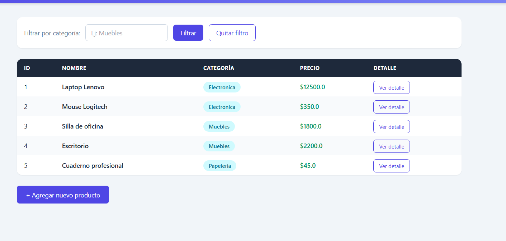
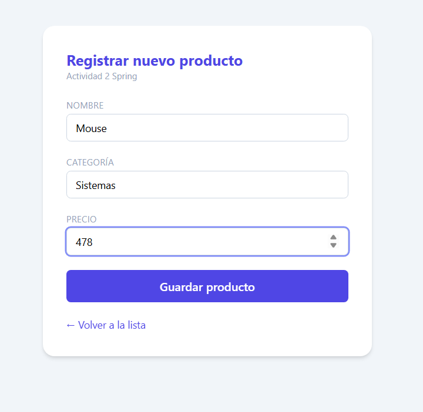
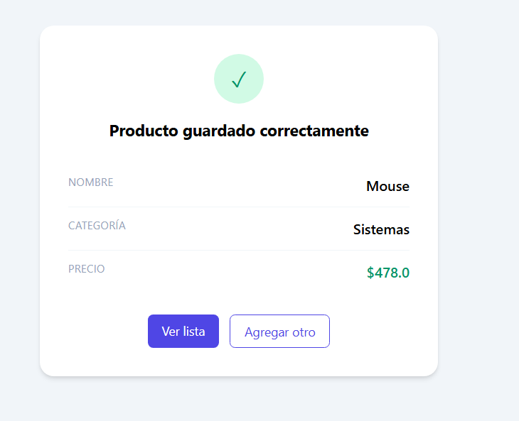
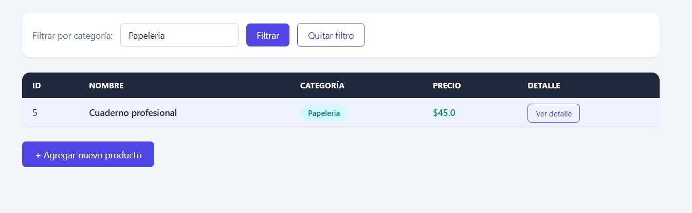
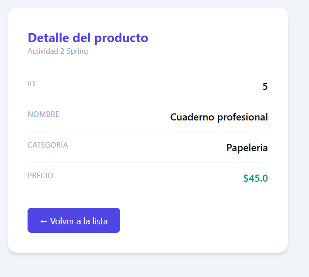
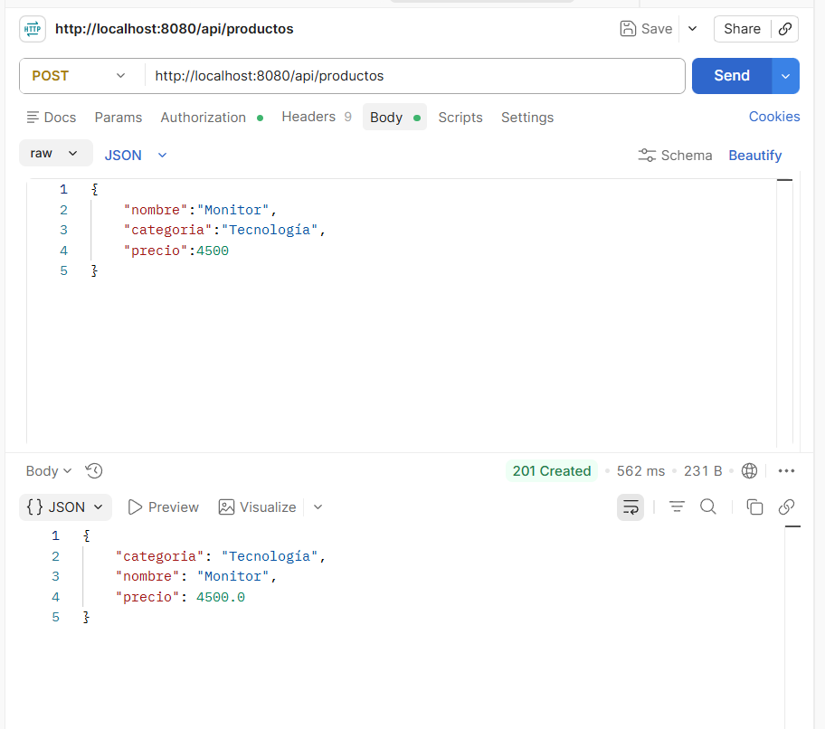

# Spring Boot MVC con Thymeleaf

## Objetivo

Comprender el patrón MVC en Spring Boot usando Thymeleaf para renderizar vistas del lado del servidor, empleando DTO, `@ModelAttribute`, `@RequestParam`, `@PathVariable`, `@Value` y un endpoint REST para recibir datos mediante una petición POST.

---

## Tecnologías utilizadas

- Java 25
- Spring Boot
- Spring Web
- Thymeleaf
- Maven
- Postman
- Visual Studio Code

---

## Funcionalidades implementadas

- Vista con listado de productos usando `th:each`.
- Formulario para registrar productos utilizando `@ModelAttribute`.
- Filtrado de productos mediante `@RequestParam`.
- Consulta de un producto por ID utilizando `@PathVariable`.
- Lectura de propiedades desde `application.properties` mediante `@Value`.
- Endpoint REST POST que recibe un objeto `ProductoDTO` en formato JSON.

---

## Capturas de pantalla

## Listado de productos

## Formulario

## Resultado del formulario

## Endpoint con @RequestParam

## Endpoint con @PathVariable

## Prueba en Postman

## Prueba en Postman

## Alumna

**Paris Lizette Gómez García**
